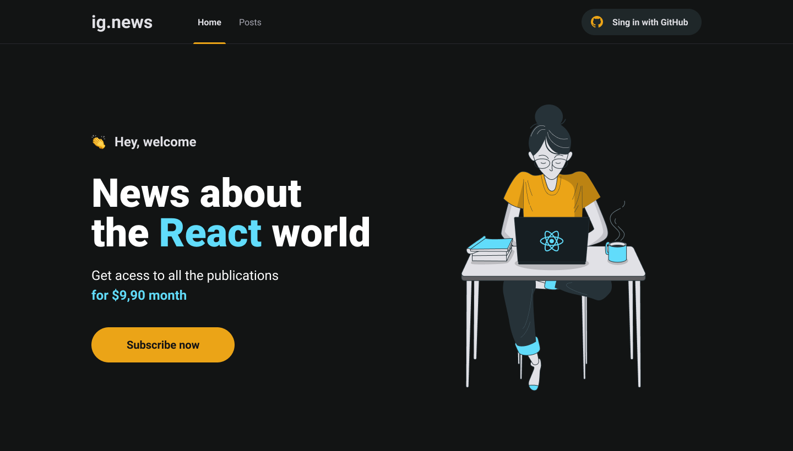

<p align="center" style="width=100%; background-color: #121414">
  
</p>

# Sobre o projeto

IgNews é um projeto desenvolvido no curso Ignite. tratase de um site de noticias desenvolvido em [next](https://nextjs.org) com integração com o [stripe](https://stripe.com/br) para pagamentos, [faunadb](https://fauna.com) como banco de dados serverless, [prismic](https://prismic.io) para CMS de noticias.

# 🛠 Tecnologias

As seguintes ferramentas foram usadas na construção do projeto:

### front-end

- [axios](https://www.npmjs.com/package/axios)
- [prismic](https://prismic.io)
- [typescript](https://www.typescriptlang.org)
- [axios](https://www.npmjs.com/package/axios)
- [framer-motion](https://www.npmjs.com/package/framer-motion)
- [next-auth](https://next-auth.js.org)
- [nextjs-progressbar](https://www.npmjs.com/package/nextjs-progressbar)
- [react-icons](https://react-icons.github.io/react-icons/)

### back-end

- [faunadb](https://fauna.com)
- [stripe](https://stripe.com/br)

# Layout web

<p align="center">
    
    
    
  </div>
</p>

# Como executar o projeto

💡 Como o back-end está em serverless não é necessário executar nenhuma configuração separada para ele.

## Pré-requisitos

Antes de começar, você vai precisar ter instalado em sua máquina as seguintes ferramentas:

- [Git](https://git-scm.com)
- [Node.js](https://nodejs.org)
- [VSCode](https://code.visualstudio.com) ou outro editor de codigos

## Rodando a aplicação

Quando clonar a aplicação não se esqueça de:

- Criar um arquivo .env com os seguintes dados:
  - Stripe
    - STRIPE_API_KEY
    - NEXT_PUBLIC_STRIPE_PUBLIC_KEY
    - STRIPE_WEBHOOK_SECRET
    - STRIPE_SUCCESS_URL
    - STRIPE_CANCEL_URL
  - Github
    - GITHUB_CLIENT_ID
    - GITHUB_CLIENT_SECRET
  - FaunaDB
    - FAUNADB_KEY
  - Prismic CMS
    - PRISMIC_ENDPOINT
    - PRIMIC_ACCESS_TOKEN

```bash
# Clone este repositório
$ git clone https://github.com/viniyamamoto/ignite-reactjs-aula-ignews
# Acesse a pasta do projeto no seu terminal/cmd
$ cd ignite-reactjs-aula-ignews

# Instale as dependências
$ yarn install

$ yarn dev

# A aplicação será aberta na porta:3000 - acesse http://localhost:3000
```

---
